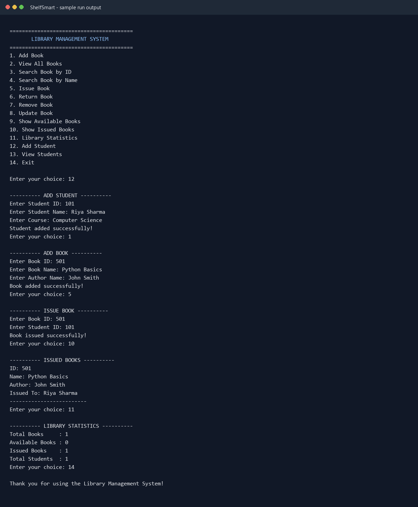

# Lybrix - Library Management System

A beginner-friendly, menu-driven Python program for managing books and student members.

## Run it

Install Python 3.10 or newer, open a terminal in this folder, then run:

```bash
python main.py
```

The program lets you add, view, search, issue, return, remove, and update books; register and list students; and display library statistics.

## Files

- `main.py` displays the menu and calls the selected operation.
- `book.py` contains book management actions.
- `member.py` contains student registration and listing.
- `statement.py` calculates and displays library statistics.
- `data.py` holds the shared lists while the program is running.

Data is currently kept in memory, so it resets when the program exits. No third-party packages are required.

## Upload to GitHub

Create a new empty repository on GitHub. From this folder, run:

```bash
git init
git add .
git commit -m "Add library management system"
git branch -M main
git remote add origin https://github.com/YOUR-USERNAME/YOUR-REPOSITORY.git
git push -u origin main
```

Replace the remote URL with the URL GitHub shows for your repository.

## Sample output

